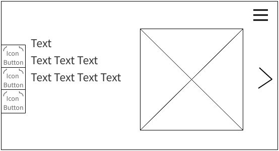
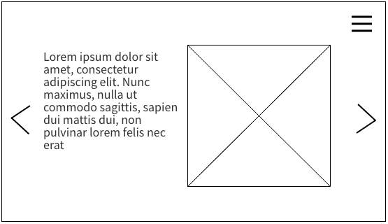
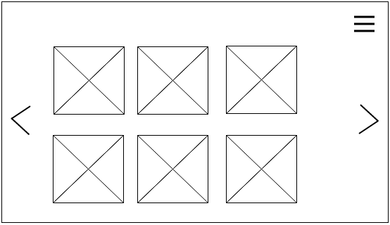
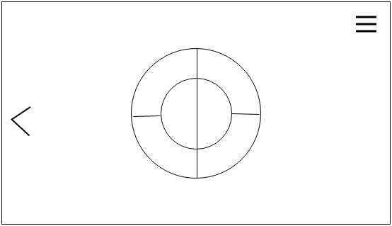
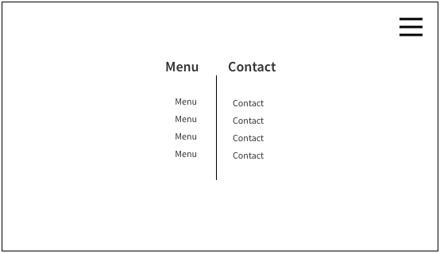
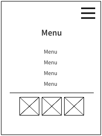

# Portfolio
---
## Requirements

* Bootstrap
* Grid layout
* Mobile first
* Bootstrap nav
* Google fonts
* Glyphs ()
* Github page
* Backgrounds
* User story
  * "As a user I should be able to see homepage"
    * wireframe

---

### User Story
#### wireframe  
The following wireframes show a vague design I used to create my portfolio.  
All of the webpages will have a nav button which will expand on the whole page. See examples on mobile navigation bar and pc navigation bar.
* __ Homepage - index.html __  
  
This is the design of my homepage which is the first thing users will see. On the left side you see buttons which will link the user to different media locations such as Github, linkedin etc.   
On the middle left you will see text saying who I am, my name and position. With an image of something in the background.  
On the middle right you will see an arrow, when clicked it will take the user to the next page of the website.

* __ About Me page - About_Me.html __  
  
This is the design of the about me page. This page will have a description and an image of myself.
There are also arrows on the middle of the right and left side of the page, when pressed they will take the user to the next page.

* __ experience page  - experience.html __  
  
This website will have images of all the projects that I have created. When the user presses the image of the project, they will be greeted with a pop-up window, which will give more information on clicked project.

* __ skills page - skill.html __  
  
This page will provide the user with a circular diagram of my skills, when the user presses a skill it will expand the tab and show them the projects I created using the skill. when the click on the project it will show them a pop up and give more information on the project (just like the experience page).  
This time this page on has a button to go to the left, as it is the last page.

* __ computer and laptop navigation bar __  
  
This navigation bar will be displayed when the "burger icon" is pressed, which will then cover the whole screen showing every page in the website on the left side, and contact details on the right which will provide the name, email, linkedin link, github link and more.

* __ mobile navigation bar __  
  
The mobile part of the navigation bar will also cover the whole screen, but as the screen is small the menu will be in the middle of the screen with a separation line bellow it, bellow the separation line you will have the image links to profile such as github, linkedin and more.

---
